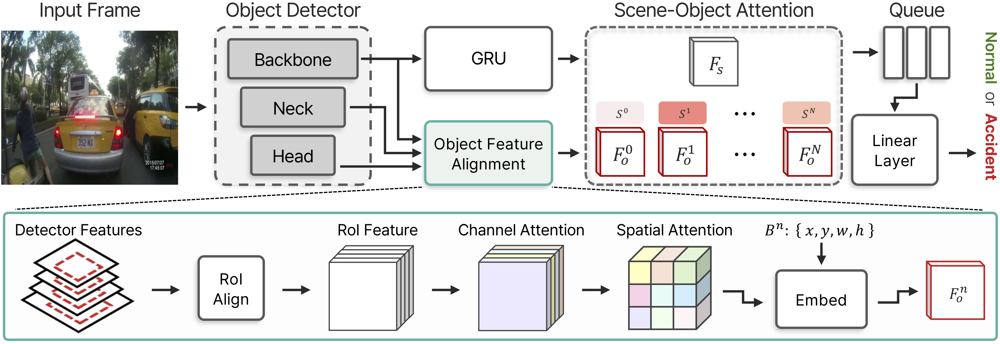

# RARE: Real-time Accident Anticipation with Reused Embeddings



This repository contains the official source code for the paper **"RARE: Real-time Accident Anticipation with Reused Embeddings"** (ICIP 2025).

RARE is a lightweight and efficient framework for traffic accident anticipation, designed for real-time performance in autonomous driving and ADAS. It achieves state-of-the-art accuracy while significantly reducing computational latency by reusing intermediate features from a single pre-trained YOLOv10 object detector.

## Key Features

- **Real-Time Performance**: Achieves 73.3 FPS (13.6ms per frame) on an NVIDIA RTX 6000 Ada, making it suitable for safety-critical applications.
- **High Accuracy**: Attains state-of-the-art Average Precision (AP) on standard benchmarks like DAD and CCD.
- **Efficient Design**: Eliminates the need for heavy modules like optical flow or separate feature extractors by directly leveraging features from the object detector.
- **Enhanced Interpretability**: Introduces an **Attention Score Ranking Loss** that explicitly guides the model to focus on accident-relevant objects, improving transparency and reliability.
- **End-to-End Framework**: Integrates a pre-trained YOLOv10 for object detection and a GRU-based temporal model for accident prediction.

## Project Structure

```
Yolov10-TAA/
├───main_taa.py             # Main script for single-GPU training
├───main_taa_ddp.py         # Main script for Distributed Data Parallel (DDP) training
├───evaluate_taa.py         # Script for model evaluation
├───taa/
│   ├───configs/            # Configuration files for datasets and models
│   ├───dataset/            # Dataset loaders (DAD, CCD)
│   ├───model/              # Model implementations (RARE, YOLOv10 integration)
│   └───util/               # Utility scripts (metrics, logging)
└───ultralytics/            # YOLOv10 submodule
```

## Getting Started

### 1. Prerequisites

- Python 3.8+
- PyTorch 2.0+
- CUDA-enabled GPU

### 2. Installation

Clone the repository and install the required packages:

```bash
git clone https://github.com/your-username/Yolov10-TAA.git
cd Yolov10-TAA
pip install -r requirements.txt
```

### 3. Datasets

This project supports the following datasets for traffic accident anticipation:
- **DAD (Dashcam Accident Dataset)**
- **CCD (Car Crash Dataset)**
- **ROL (Rear-end Collision Likeliness)**

Please download the datasets and place them in the `taa/data/` directory, or update the `root_path` in the corresponding configuration file (`.yaml`) in `taa/configs/`.

## Training

You can train the RARE model using either a single GPU or multiple GPUs with Distributed Data Parallel (DDP).

### Configuration

Training parameters, model settings, and dataset paths are managed through YAML configuration files in `taa/configs/`.

Example configuration (`taa_DAD_yolov10.yaml`):
```yaml
model:
  detector: 'yolov10x'
  conf_thresh: 0.10
  opticalflow: 'None'

train:
  num_epochs: 100
  batch_size: 2
  optimizer: 'SGD'
  learning_rate: 5e-2

dataset:
  name: 'DAD'
  root_path: './taa/data/DAD'
  img_size: [640, 640]
  fps: 20.0
```

### Single-GPU Training

Run the `main_taa.py` script to start training on a single GPU.

```bash
python main_taa.py
```
The script will use the default configuration specified within it (`taa/configs/taa_DAD_yolov10.yaml`).

### Multi-GPU Training (DDP)

For faster training on multiple GPUs, use the `main_taa_ddp.py` script.

```bash
python main_taa_ddp.py
```
This will launch a DDP training session using the settings in the configuration file, including the list of `gpu_ids`.

## Evaluation

To evaluate a trained model, use the `evaluate_taa.py` script. Make sure to specify the path to the model checkpoint.

1.  Open `evaluate_taa.py`.
2.  Set the `config` file path and the `checkpoint_path`.
3.  Run the script:

```bash
python evaluate_taa.py
```

The script will load the model and the test dataset, compute the loss, and calculate evaluation metrics such as Average Precision (AP) and mean Time-to-Accident (mTTA).

## Citation

If you find this work useful for your research, please cite our paper:

```bibtex
@misc{song2025realtimetrafficaccidentanticipation,
      title={Real-time Traffic Accident Anticipation with Feature Reuse}, 
      author={Inpyo Song and Jangwon Lee},
      year={2025},
      eprint={2505.17449},
      archivePrefix={arXiv},
      primaryClass={cs.CV},
      url={https://arxiv.org/abs/2505.17449}, 
}
```
